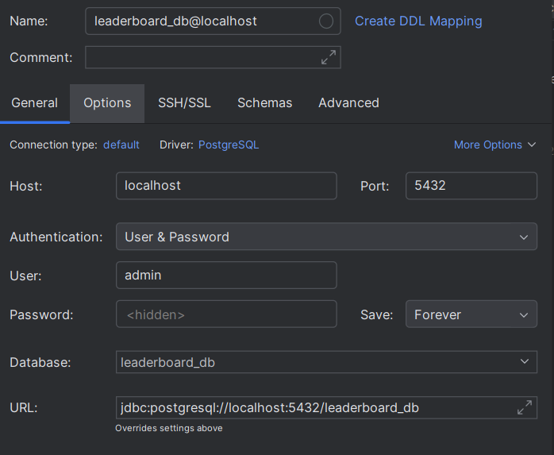

# Aplikacja Liderboardu - Turniejowa Tabela Wyników

[](https://www.gnu.org/licenses/agpl-3.0)


Aplikacja webowa do zarządzania turniejami, drużynami, meczami oraz wyświetlania tabeli ligowej z możliwością oceniania wyników.

## ✨ Funkcje

- 🏆 Tworzenie i zarządzanie turniejami
- 👥 Dodawanie graczy i drużyn
- ⚽ Generowanie meczów i wprowadzanie wyników
- 📊 Automatyczne generowanie tabeli ligowej
- 🎨 Intuicyjny interfejs z responsywnym designem
- 🔒 Bezpieczne połączenie z bazą danych

## 🛠 Technologie

- **Frontend**:
    - Next.js 13+ (App Router)
    - React 18
    - TypeScript
    - Tailwind CSS
- **Backend**:
    - Next.js API Routes
    - Node.js
- **Baza danych**: PostgreSQL
- **Narzędzia**: WebStorm, pgAdmin

## 📦 Wymagania wstępne

- Node.js (wersja 18 lub nowsza)
- PostgreSQL (wersja 12 lub nowsza)
- npm (zwykle dołączony do Node.js) lub Yarn

## 🚀 Instalacja i Konfiguracja

### 1. Sklonuj repozytorium

```bash
git clone https://github.com/twoja_nazwa_użytkownika/nazwa_repozytorium.git
cd nazwa_repozytorium
```

### 2. Zainstaluj zależności

```bash
npm install
# lub
yarn install
```

### 3. Skonfiguruj bazę danych PostgreSQL

- Utwórz nową bazę danych (np. `leaderboard_db`)
- Utwórz użytkownika z uprawnieniami (np. `leaderboard_user`)
- Ustaw zmienne środowiskowe w pliku `.env.local`:

```env
DB_USER=twój_użytkownik
DB_PASSWORD=twoje_hasło
DB_HOST=localhost
DB_PORT=5432
DB_DATABASE=leaderboard_db
```

### 4. Uruchom aplikację

```bash
npm run dev
# lub
yarn dev
```

### Uruchomienie bazy danych w terminalu

```bash
docker-compose up -d
```


```bash
docker-compose exec db psql -U admin -d leaderboard_db
```

Aplikacja będzie dostępna pod adresem: [http://localhost:3000](http://localhost:3000)


## 📄 Licencja

Ten projekt jest dostępny na licencji [GNU Affero General Public License v3.0](LICENSE). Oznacza to, że:
- Możesz używać, modyfikować i udostępniać aplikację
- **Zabronione jest komercyjne wykorzystanie projektu**
- Nie musisz oznaczać autora w produkcie końcowym
- Wszelkie zmodyfikowane wersje muszą być udostępnione na tej samej licencji

## 🤝 Wkład do projektu

Zapraszamy do zgłaszania problemów i propozycji ulepszeń! Proszę utworzyć nowy "issue" przed złożeniem "pull request".

## 📞 Kontakt

Masz pytania? Skontaktuj się ze mną przez [GitHub Issues](https://github.com/ItlumNaimad/Leaderboard_React/issues) lub [naimad2003@wp.pl](mailto:naimad2003@wp.pl)
## ##########################################
## #STWORZONE README PRZEZ INICJALIZACJĘ NPM#
## ##########################################
This is a [Next.js](https://nextjs.org) project bootstrapped with [`create-next-app`](https://nextjs.org/docs/app/api-reference/cli/create-next-app).

## Getting Started

First, run the development server:

```bash
npm run dev
# or
yarn dev
# or
pnpm dev
# or
bun dev
```

Open [http://localhost:3000](http://localhost:3000) with your browser to see the result.

You can start editing the page by modifying `app/page.tsx`. The page auto-updates as you edit the file.

This project uses [`next/font`](https://nextjs.org/docs/app/building-your-application/optimizing/fonts) to automatically optimize and load [Geist](https://vercel.com/font), a new font family for Vercel.

## Learn More

To learn more about Next.js, take a look at the following resources:

- [Next.js Documentation](https://nextjs.org/docs) - learn about Next.js features and API.
- [Learn Next.js](https://nextjs.org/learn) - an interactive Next.js tutorial.

You can check out [the Next.js GitHub repository](https://github.com/vercel/next.js) - your feedback and contributions are welcome!

## Deploy on Vercel

The easiest way to deploy your Next.js app is to use the [Vercel Platform](https://vercel.com/new?utm_medium=default-template&filter=next.js&utm_source=create-next-app&utm_campaign=create-next-app-readme) from the creators of Next.js.

Check out our [Next.js deployment documentation](https://nextjs.org/docs/app/building-your-application/deploying) for more details.
